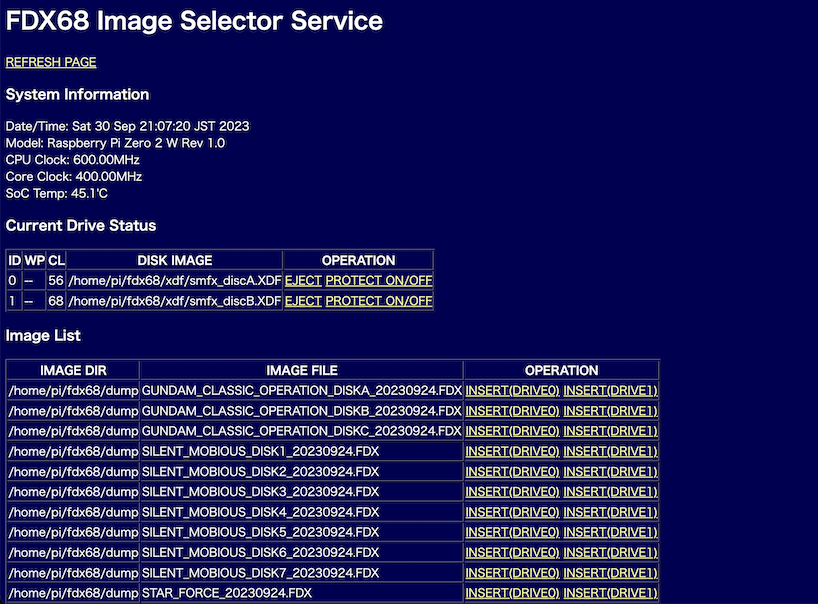

# fdxseld

FDX68 image file selecter service

## About This

GIMONS氏設計開発のFDX68関連ツール`fddctl`のWebラッパーです。ブラウザを使ってイメージのマウントやイジェクトを手軽に行うことができます。

## 注意点

* 本ソフトウェアを使ったことで何か問題が出た場合、ご迷惑になりますのでくれぐれもGIMONS氏に問い合わせを行わないようにしてください。
* 何かあればまずは tantan (X/twitter @snakGH) まで。
* ダンプモードには対応していません。

## インストール方法

  本ソフトウェアはPythonで書かれており、pipを使ったパッケージインストールが可能です。
  FDX68のセットアップが完了している状態で、以下のコマンドで導入します。

    sudo apt install git pip
    pip install git+https://github.com/tantanGH/fdxseld.git

  `/home/pi/.local/bin` を実行パスに追加しておきます。

    echo 'export PATH=/home/pi/.local/bin:$PATH' >> ~/.bashrc
    source ~/.bashrc

## 使用方法

    fdxseld [options]

    option:
      -p (--port) <n>                     ... 待ち受けTCPポート番号を指定します。デフォルトは6860です。
      -c (--fddctl_cmd) <cmd-path>        ... fddctl コマンドの場所をフルパスで指定します。デフォルトは /home/pi/fdx68k/bin/fddctl です。
      -i (--image_dir_list) <image-dirs>  ... FDX/XDF イメージファイルの置かれたディレクトリ名をカンマで区切って指定します。

  実行例：

    sudo /home/pi/fdx68/bin/fddemu &
    nohup fdxseld -p 6860 -c /home/pi/fdx68k/bin/fddctl -i /home/pi/fdx68k/xdf,/home/pi/fdx68k/dump > log-fdxseld &

  注意：あらかじめ`fddemu`をroot権限で動作させておく必要があります。

  サービスが起動した後、ブラウザでアクセスします。

    http://(host):6860/
  
  ブラウザ上の操作は自明なので省略。

## 変更履歴

* 0.1.0 (2023/09/30) ... 初版